# Курс языки программирования
## Большевых 2262

# Лабораторная Работа 1

### Задание 1
* Вводные понятия:
* Исполняемый файл (исполняемый код) - файл, содержащий программу в виде набора элементарных инструкций, которая после загрузки в память может быть выполнена на определенном физическом устройстве (процессоре) под управлением опредленной
операционной системы.
* Ассемблер - язык программирования низкого уровня, в котором каждая инструкция физического устройства представлена в текстовом виде
* Исходный код - программа написанная на языке высокого уровня 
* Виртуальная машина - это средство описания семантики языка программирования
* Стандарт языка программирования - документ, описывающий язык программирования максимально подробно и, по возможности, наиболее формально

* Трансляция программ:
* Транслятор - техническое средство, осуществляющее перевод текста программы с одного языка на другой 
* Компилятор - транслятор, переводящий программу в машинный код для последующего исполнения (С++)
* Интерпретатор - транслятор, читающий и исполняющий программу по одной команде (Lisp)
* Псевдокомпилятор - транслятор, переводящий программу в промежуточное представление (байт-код), который состоит из набора инструкций близких по смыслу к машинному коду
* Компилирующий интрепретатор - транслятор, переводящий текст программы во внутреннем представление непосредственно после запуска. В процессе работы программа интерпретируется уже в этом представление (Python)
* REPL-интерпретатор - программное средство, работающее в цикле чтения-вычисления-печати (Read-Eval-Print Loop)
* Ассемблер - язык программирования низкого уровня, в котором каждая инструкция физического устройства представлена в текстовом виде
* Виртуальная машина - это средство описания семантики языка программирования
* Стандарт языка программирования - документ, описывающий язык программирования максимально подробно и, по возможности, наиболее формально

* Трансляция программ:
* Транслятор - техническое средство, осуществляющее перевод текста программы с одного языка на другой
* Компилятор - транслятор, переводящий программу в машинный код для последующего исполнения (С++)
* Интерпретатор - транслятор, читающий и исполняющий программу по одной команде (Lisp)
* Псевдокомпилятор - транслятор, переводящий программу в промежуточное представление (байт-код), который состоит из набора инструкций близких по смыслу к машинному коду
* Компилирующий интрепретатор - транслятор, переводящий текст программы во внутреннем представление непосредственно после запуска. В процессе работы программа интерпретируется уже в этом представление (Python)
* Единица трансляции - минимальный фрагмент программы, который может быть транслирован независимо от остального кода

* Предобработка в С++:
* Препроцессинг (предобработка) - начальный этап трансляции программы 

* Сборка и запуск программ:
* Сборка - заключительный этап трансляции, результатом которого является исполняемый файл
* Объектный файл - результат трансляции модуля, который является переходным от текста программы к исполняемому файлу
* make - утилита для управления процессом компиляции и сборки программ

### Задание 2
* ALT+F1 - выбор диска на левой панели
* F7 - создать новую папку
* Shift + F4 - создать новый текстовый файл
* F3 - просмотреть файл
* F4 - редактировать уже существующий файл
* F5 - копирование файлов и папок 
* F6 — переместить или переименовать выделенный файл или папку
* F8 — удалить файл или папку
* Enter — зайти в выделенную папку.
* F10 — выход из Far Manager

### Задание 3
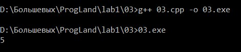

### Задание 4 
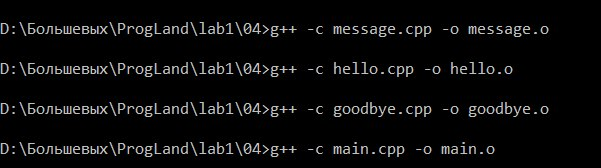
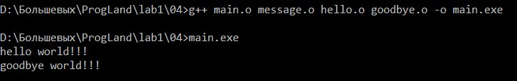
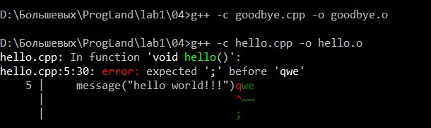
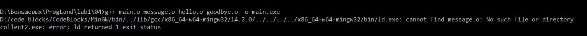

### Задание 5
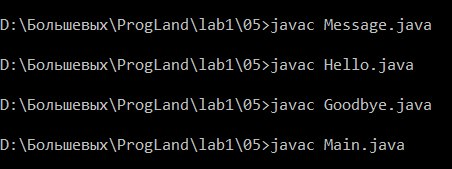
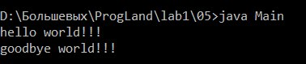
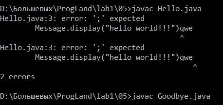
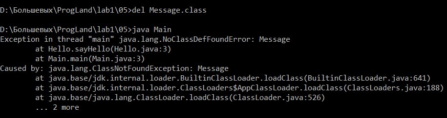

### Задание 6
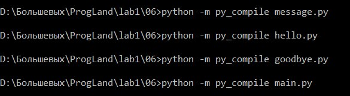
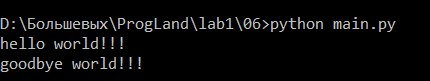
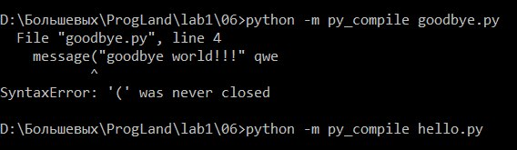
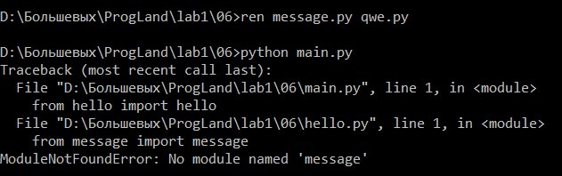

### Задание 8
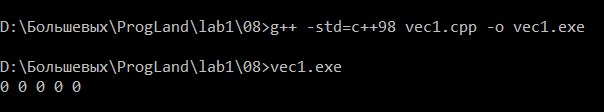
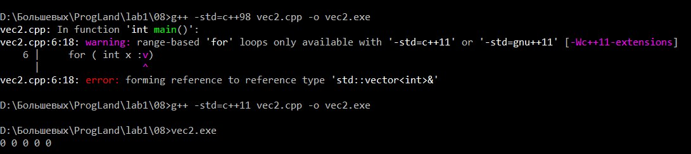
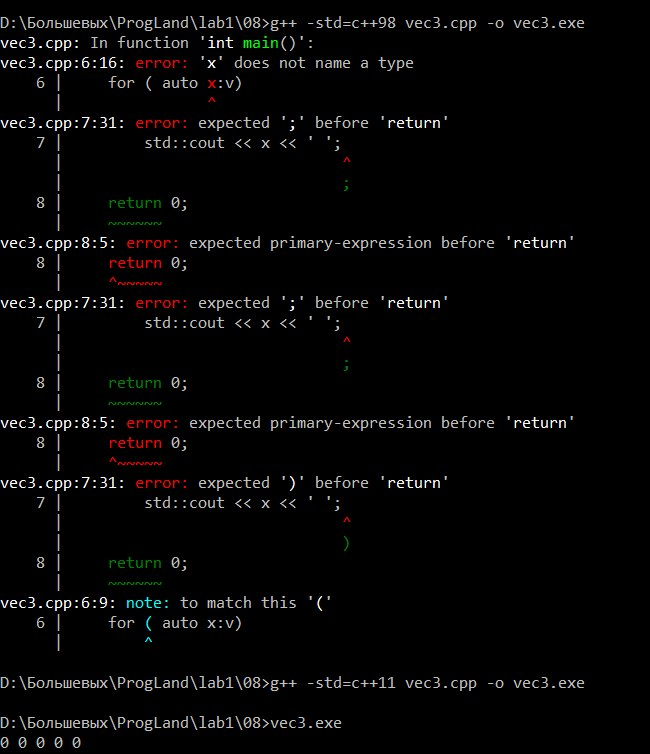
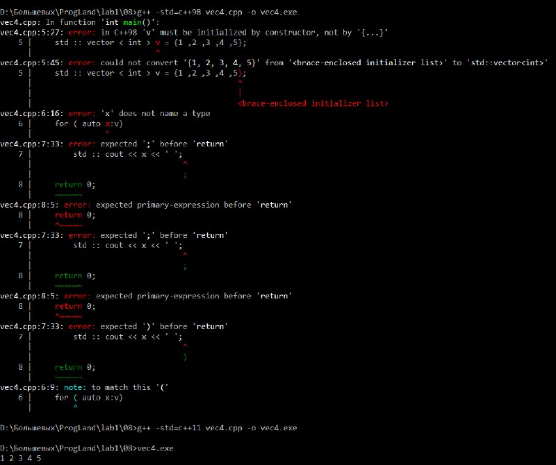
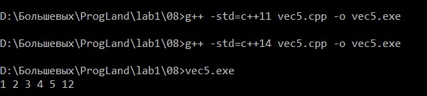
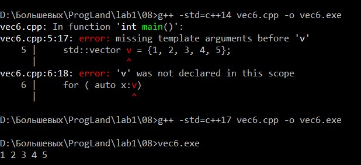

### Задание 9
* Переменные: при -O0 x и s размещаются в памяти, в области стека (-4(%rbp) и -12(%rbp)). При -O1 и -O2 компилятор хранит их только в регистрах, исключая обращения к стеку
* Кадр стека: на -O0 создаётся стандартный стековый кадр: pushq %rbp - сохранение старого указателя кадра, movq %rsp, %rbp - установка нового. На -O1 и -O2 кадр стека не формируется, регистр rbp не используется
* Цикл: при -O0 цикл выполняется 123 итерации (видно по командам cmpl и jle) при -O1 операция накопления s += x заменена на умножение imull $123, %edx, %edx, но управляющая часть цикла остаётся (subl $1, %eax; jne).
При -O2 цикл полностью удалён, остаётся только вычисление imull $123, 44(%rsp), %edx.
* Возврат из функции: на -O0 и -O1 перед return 0 используется movl $0, %eax, на -O2 применяется более компактная форма xorl %eax, %eax.
* Результат вычислений (123 * x) одинаков на всех уровнях оптимизации, различается только структура машинного кода.